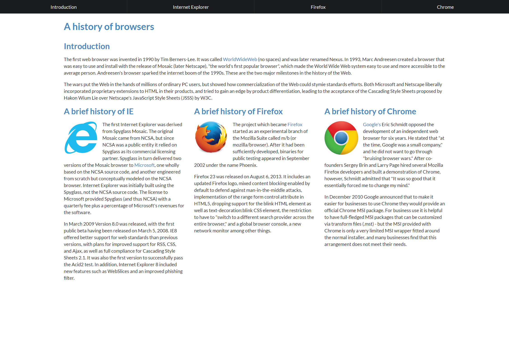

## Intro

Imagine if you were tasked with trying to draw out a copy of something like a sign or placard. For example, it could be a street sign, or of a poster on a bulletin board. You could try to do so by drawing everything free-hand with no tools, not even a ruler or straight edge. Sure, it may seem straightforward to just copy whatever you see in front of you, but when you finish you may realize that some elements don’t look right. For example, letters that are supposed to be exactly identical to each other may end up becoming different sizes, or lettering that should be on the same line may not end up appearing in a completely straight line.

Conversely, what if you had some extra tools to work with? For one, having a ruler will allow you to more easily keep elements aligned. Along with that, having some sort of stencils like those for lettering will allow you to consistently have said elements appear identical whenever they are used.

## Using Semantic UI

Like how using tools like stencils and rulers allow one to consistently add in elements such as letters with appropriate alignment, using a UI framework such as Semantic UI allows us to do something similar. Semantic UI provides various types of elements such as buttons, labels, and icons. For example, this makes use of Semantic UI’s label and icon features to show labels on the img:

This example also makes use of the grid collection, which is one way to easily have elements aligned in a desired manner. This is also demonstrated with the following example, which includes several drop-down items (MEN, WOMEN, KIDS, BRANDS):

## Comparing Semantic UI to plain CSS and HTML

In addition, we can compare how a site with Semantic UI can compare with a site made with plain CSS and HTML.

For instance, we have two example sites made with only plain CSS and HTML. The first one has a simple layout:

In the second example, we see the information organized into columns. We also notice an issue with said columns:

With plain CSS and HTML, the sites look more very simplistic, if not dated. In addition, the elements in the second one have a large gap, as the example is meant to fit in a smaller window.

Conversely, let’s look at an equivalent site made with Semantic UI:

At the top, we have navbar instead of the bullet list or line of links in the plain CSS + HTML examples. The columns are also properly formatted based on the size of the screen, and there is also a menu at the very top.

## Conclusion

In conclusion, UI frameworks make it easier to easily make different types of elements, and also make it easier to arrange said elements in the desired manner.

