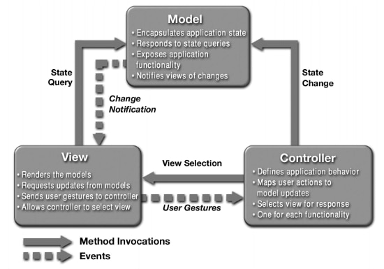
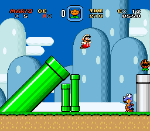
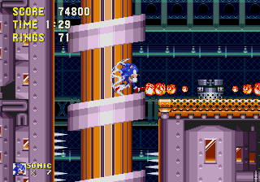

## Different fields, same concept

Design patterns can be observed in various fields and disciplines. They entail the fundamentals of how to solve a commonly occurring type of problem. One can probably look at what is around them and quickly spot some kind of object created according to a design pattern. For example, if you are reading from a computer or laptop of some sort, you will have some way to select items, whether it is a touchpad or mouse. Such devices could be considered design patterns themselves, as they can come in various forms, with varying button count and form factor. 

## The Model-View-Controller

Of course, as a computer science student, the design patterns that would be the most relevant to me would be those applicable to software development. One such design pattern is the MVC, or model-view-controller. A common fixture of web and UI development, the general idea is to separate how data is represented to the user from how it is represented internally. A diagram of the different components of the MVC is shown here:

We can see the concepts of the MVC applied with the signup page for the [Manoa Organizational Database](https://manoa-organization-database.github.io/). This is how the page looks like:

The view for this page in particular renders the various fields of the sign-in form, the prompt above the form, and the navbar at the very top. The view also takes whatever the user enters into the fields of the form and sends it to the controller, which then modifies the model/database. These three aspects can be partitioned to different people when applied to the scale of a full project, such as assigning database-centric people to the model and assigning UI/art-specialized people to the view.

## Like genres

As described earlier, design patterns describe the fundamentals of approaching a particular problem. They don't specify a specific way to implement a solution, but have the general fundamental ideas that apply to all solutions for that type of problem. In a way, I think that they are similar in game genres in that regard. Let's consider two 2D platformer games; Super Mario World (left), and Sonic 3 & Knuckles (right):

---

  
  

---

Despite being pretty different games, both share certain fundamental qualities such controlling a character jumping from platform to platform, obstacles, and a two-dimensional perspective. From there, each game makes their own twists in terms of how their characters play and other aspects of their games. In addition, aspects of the MVC can be applied, such as partitioning aspects such as the UI and art, and the game physics and mechanics.

