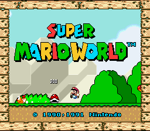

## Computer science wasn't initially a consideration

I had always had an interest in understanding how things worked, the process and history of how various things were created, and creating things. Over time, learning about the development history of games I grew up with, such as *Super Mario World*, along with learning about the history of the various consoles and computers that would run those games would lead to a bit of an interest in computers, aside from just frequently using them. However, I would end up going with transportation and mechanical engineering as my subject of choice in high school and college, as machines such as aircraft were a much greater interest to me, and for much longer compared to computing. 

About two and a half years in engineering, I would eventually change majors over to computer science. With the start of the pandemic, and after struggling to learn the required higher level calculus and mechanical engineering concepts despite doing what felt like everything in my power, I thought that perhaps I need to change things up. I still wanted to work with technology, and so I decided to go with computer science.

## Making the switch over

However, I had only taken a Java class to fulfill an engineering requirement. Going into this new major, I felt my programming experience would have been lacking compared to my peers, but I was willing to learn. Up to this point, my programming journey has been a very challenging, but engaging one to go through. With my lack of experience compared to my peers and classmates, I have had to put a good focus on just worrying about getting the fundamentals down. I hope that I can continue to become a more proficient programmer, especially with my problem-solving skills and my familiarity with different languages and software. I also want to improve my ability to program in a team, as I have worked solo in all my programming classes so far.

Although this would be the low-hanging fruit in terms of programming/software engineering interests, game design and development has been an interest I’ve had in mind every so often. As mentioned before, I would often look into the development process of different games that I was familiar with, eager to understand how they were made. Although it has been an interest, I have been trying to keep it on the backburner for the time being. This is for two reasons; I don’t want to have it distract myself from getting my programming/computer science fundamentals down, and to broaden my horizons. Being new to the vast field of programming and software engineering as a whole, I want to be able to figure out if fields like web development and design may catch my interest.

