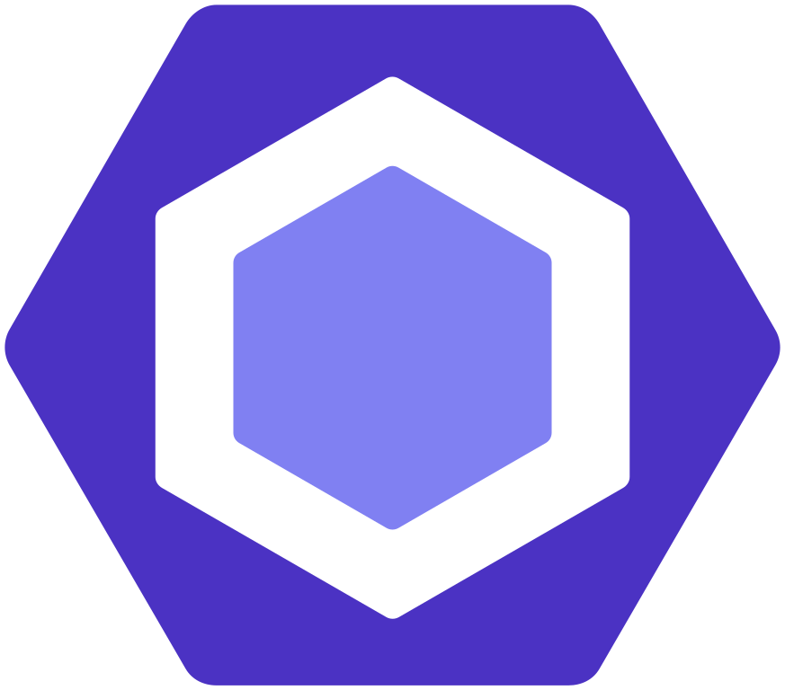

## Closing out a semester

It has been a long road, but the end of the semester marks the end of my time in this software engineering class. Throughout the semester, there were various software engineering concepts we were able to learn and apply. Although web application development was the majority of assignments focused on, there were several concepts that I felt could be applicable to game development, a field that I consider pursuing.

## Coding standards

One of the first fundamental concepts we explored in the semester were coding standards. Coding standards ensure that code written by different people stays readable and consistent, as if it was written all by one person. They usually also ensure that common syntax and language-related errors are not present in the code.

After making use of [ESLint and the AirBnb Javascript Style Guide](https://github.com/airbnb/javascript) in an automated manner on the IntelliJ IDEA IDE throughout the semester for the various projects, I have been able to understand the usefulness of having an automated check for code style. For instance, it helped with making sure I used const or let instead of var for variable references, and overall aided in my learning of JavaScript.

As for game development (and in a general programming sense, regardless of field), I think coding standards will be a useful concept to apply in this regard. Especially in the case of larger development teams, having code that was consistent and readable regardless of who wrote it would be very beneficial in making work easier overall. In addition, it can be a useful learning tool when learning other programming languages, by warning when less-than-ideal syntax is used.

## Agile project management: IDPM

Software development process models are a way to describe the particular methods and practices used when creating software, and the tools used to mae them. Agile project management are a particular category of models, with a focus on quick product turnaround and constant feedback from the customer, being most effective with smaller teams. IDPM, or issue driven project management is a particular type of agile project management, which makes use of these guidelines (assuming GitHub is used):

 * Meet twice a week to determine what tasks must be done.
 * No tasks take more than 3 days to do, with all tasks detailed by an issue assigned to one person. No need to plan all the tasks at once.
 * Issues are sorted into milestones using project boards, with set due dates.
 * Each person has at least one issue they are in charge of closing.

Here is an example of a project board: 

I think that agile models such as IDPM may be something I encounter in the game development when in smaller teams or organizations. It would probably even be something I would use to facilitate development for situations such as personal projects. With tasks having to be at most 3 days worth of work, it allows for more larger tasks to be broken down into more manageable bits. Within the context of game development, the end of milestones would still conclude with the release or testing of the product at that point in development.