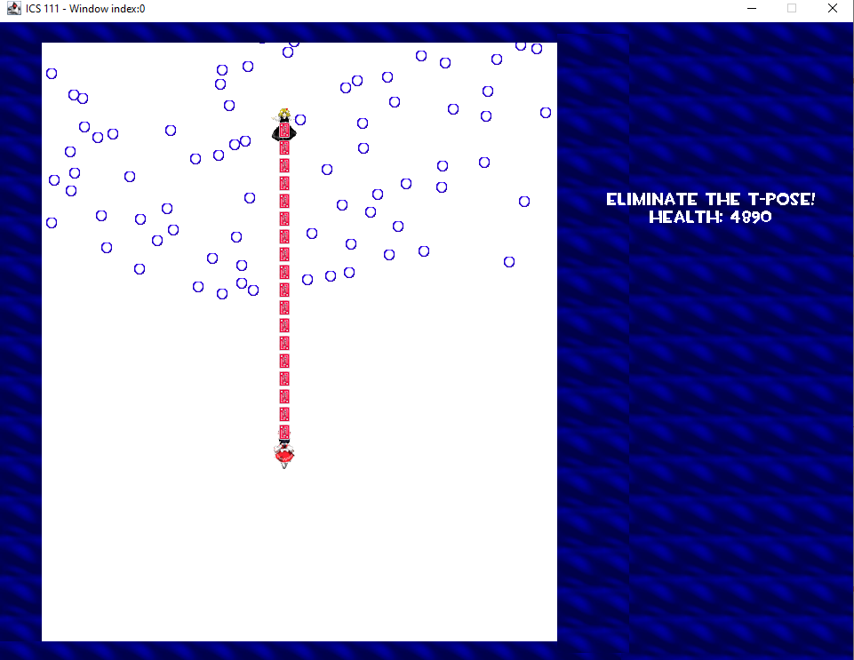

## Intro: how I decided to do the project

Embodiment of the T-posing Devil is a Touhou Project-inspired vertical shoot-em-up game I developed as a final project for ICS 111, Fall 2019. The Touhou Project series of shoot-em-up games are a notable example of the “bullet hell” subgenre, where the player often has to face dense and difficult to dodge bullet patterns that can blanket most of the screen. This project was an opportunity to experiment and apply what I had learned throughout the semester, and with the freedom to make whatever I wanted.

## Game objective:

The objective of the game is simple: don't get hit by the blue bullets, and shoot the boss until they're defeated.

## How I created this project

For this project, I made use of the EZ.Java class provided by my ICS 111 instructor, which provided methods for moving img around, sound playback, control binding, and other features. Some aspects of the game were created using what was provided throughout the semester, and modifying it to suit what was needed. For example, the code used to spawn the bullets and make them move was based on an example provided earlier in the semester, where random bubbles were spawned and moved up the screen.

Here is some brief gameplay footage:

  <iframe src="https://www.youtube.com/embed/Y9jdQ1VIyWM?si" 
          title="YouTube video" 
          allowfullscreen>
  </iframe>

Source code may be found [here](https://github.com/msumaylo/ICS111F19-touhou-EoTD).

