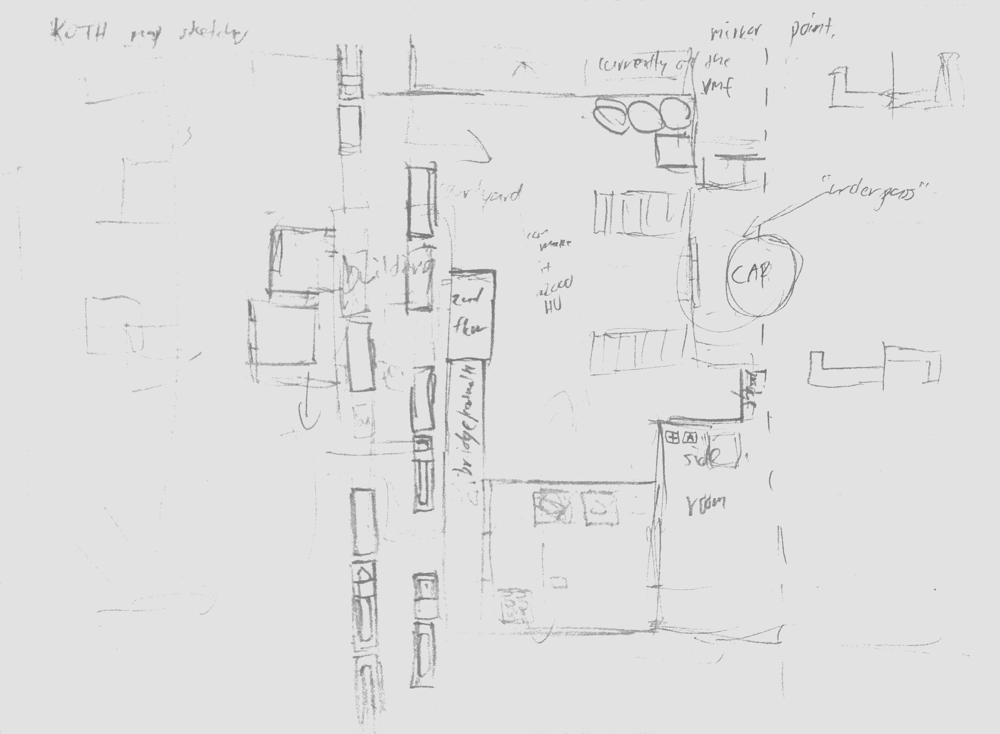
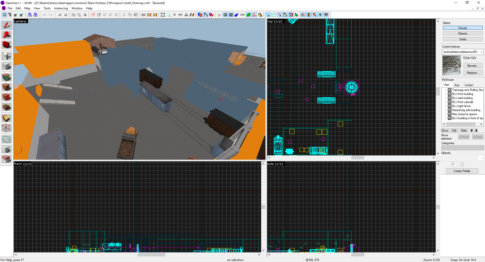

## Intro

This custom map is a personal project to create a custom map for the video game Team Fortress 2.

## Background information

Team Fortress 2 is a team-based first-person multiplayer shooter released by Valve in 2007. In this game, players can choose between 9 playable classes to team up and defeat the opposing team. Each class has differring playstyles, which includes:

- Scout: close-combat class with low health, fastest walkspeed has double-jump for extra mobility.
- Soldier: jack-of-all-trades class, with various weapon options (i.e., support weapons for buffs, items that help improve individual mobility).
- Pyro: close-combat class using fire weapons that can inflict lingering damage and "airblast" to reflect or push projectiles or enemies.
- Demoman: jack-of-all trades class capable of setting up traps to cover large areas, or doing heavy damage.
- Heavy: has largest health pool, slowest walkspeed but minigun can do good sustained damage.
- Engineer: defensive class using automated sentry guns, can support with "dispensers" that give health and ammo, and teleporters that help teammates move far.
- Medic: healer, can also use various "ubercharges" that depending on the kit, make teammates temporarily invincible, increase heal-rate, increase damage, or provide weapon-specific resistances.
- Sniper: long-range fighter, can pick off key targets but requires good aim.
- Spy: stealth-based class, uses disguises and various invisibility watches to sneak and deceive opponents to eliminate key targets.

Maps teams fight on have different game modes, such as capture the flag, or control-point modes like King of the Hill, where you need to 

More information on this game, classes, modes and mechanics can be found on the [official wiki](https://wiki.teamfortress.com/wiki/Main_Page).

## Description

This map was created using [Hammer++](https://ficool2.github.io/HammerPlusPlus-Website/), a community-created upgrade to Hammer, Valve's official editor for the Source Engine. Before starting this map, I started making a rough sketch (scan shown below with exposure and contrast adjusted for visibility) of how I wanted the map to be laid out.

Once I created the sketch, I started creating the initial version of the map in Hammer++, using TF2's dev textures to just block out the various sections of the map. 
I went with the setting of a railyard, as it would allow me to use the game's existing railcar models to act as platforms and walls for certain sections of the map. In addition, it allowed me to not have to make very complex displacements (what Source uses to have more naturalistic terrain) until later.

Once completing some sections of the map, I would then have Hammer++ compile the map and then run the map in Team Fortress 2. I would usually walk around and test it using various classes, to see if they would be able to traverse across certain jumps, or make use of their movement abilities in an intended manner.

(add more)

## Considerations made

When creating the map, there were several factors I took note of while making the layout of the map. For example, 

(right path from spawn, broken up w/ props to allow classes to go that way without having snipers completely lock it down)

## Video

(insert video)

