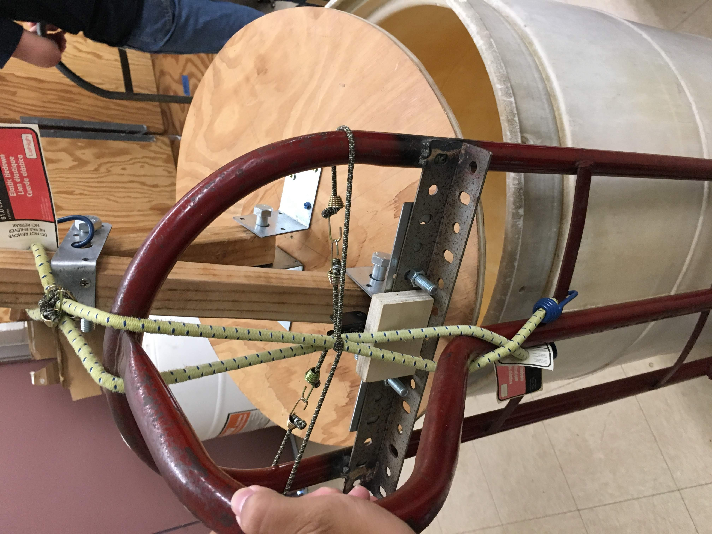

## Intro

This trash compactor prototype was created by myself and two other classmates in my senior year at McKinley High School. At this time, I was pursuing Engineering as my major of choice. This project helped me learn how to work in a group, and how to be resourceful.
                                                        
This prototype was created to solve the issue of trash cans being overfilled during the lunch period. Due to the design being a prototype and the fact that we wanted to make the design itself simple and easy to build, we constructed it using resources that were either easy to acquire, or were sitting around unused. The hand truck used to attach the compactor to was lying unused in the house of one of our team members, the wood was leftover wood from the woodshop teacher, and the metal fittings and bungee cables were ones found in hardware stores.

## Contributions

  
  

My contributions to this project was conceptualizing the design and the drafting of the design using Computer Aided Design (CAD). The conceptualizing process was carried out collectively between the three of us, but CAD work was primarily carried out by me, with my teammates sharing some of the CAD duties along with their roles of construction and resource gathering. The main software I made use of was [OnShape](https://www.onshape.com) for CAD drafting and the collaboration that it could facilitate.
